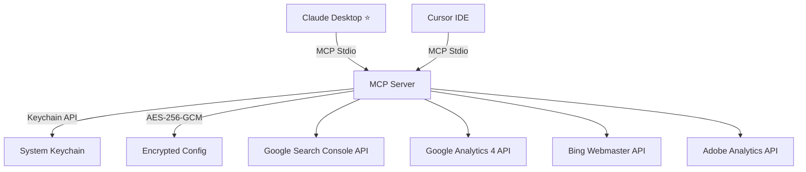

<div align="center">

# 🚀 MCP by Amal Alexander

### One AI Command. Four Platforms. Instant SEO Intelligence.

**Connect Claude Desktop to Google Search Console · GA4 · Bing Webmaster Tools · Adobe Analytics**  
and ask questions in plain English — no dashboards, no exports, no switching tabs.

<br/>

[](https://opensource.org/licenses/MIT)
[](https://www.typescriptlang.org/)
[](https://modelcontextprotocol.io/)
[](https://github.com/amal-alexander/mcp/actions/workflows/ci.yml)
[](https://www.linkedin.com/in/amal-alexander-305780131/)

<br/>

[📚 Documentation](https://searchconsolemcp.amal-alexander.com/) · [🐛 Report Issue](https://github.com/amal-alexander/mcp/issues) · [💼 LinkedIn](https://www.linkedin.com/in/amal-alexander-305780131/) · [✉️ Contact](mailto:amalalex95@gmail.com)

</div>

---

## 🤔 What Is This?

This is a **Model Context Protocol (MCP) server** — a bridge that gives AI assistants direct, live access to your SEO data platforms.

Instead of:
- Logging into 4 dashboards
- Exporting CSVs
- Copy-pasting data into ChatGPT/Claude
- Waiting for reports

You just **open Claude Desktop and ask**:

> *"Why did my traffic drop last week and which pages are responsible?"*

The MCP server fetches the live data, runs the analysis, and gives you an answer in seconds. No spreadsheets. No exports. No switching tabs.

---

## 🔌 Works With Claude Desktop (Primary) + Other MCP Clients

> **Important:** This server uses the [Model Context Protocol (MCP)](https://modelcontextprotocol.io/) — an open standard by Anthropic. It is **primarily designed for Claude Desktop**, which has the most complete and polished MCP support. It also works with other MCP-compatible clients:

| Client | Support Level | Notes |
|--------|--------------|-------|
| **Claude Desktop** ⭐ | ✅ Full | **Recommended — best experience** |
| Cursor IDE | ✅ Full | Works via `.cursor/mcp.json` |
| VS Code (Copilot) | 🔶 Partial | MCP support varies by extension |
| Windsurf | ✅ Full | Supports MCP natively |
| Other MCP Clients | 🔶 Varies | Must support MCP stdio transport |

> **Not compatible with:** ChatGPT, Gemini, raw API calls, or browser-based AI tools — those do not support the MCP protocol.

---

## ✨ What You Can Do (Magic Prompts)

Paste any of these into **Claude Desktop** after setup:

```
"My traffic dropped this week — find exactly when it started and which pages are responsible."
```
```
"Find keywords where I rank 8-15 with over 1,000 impressions. These are my quick wins."
```
```
"Are any of my pages cannibalizing each other for the same keyword? Which should be primary?"
```
```
"Compare my Google vs Bing performance. Where am I stronger on Bing?"
```
```
"Run a full SEO health check. Give me 3 high-impact actions for this week."
```
```
"Which of my top pages have high impressions but terrible CTR? Fix the titles."
```
```
"Correlate my PageSpeed scores with ranking drops. Is slow speed hurting me?"
```

---

## 📦 Platforms Connected

| Platform | What It Unlocks |
|----------|----------------|
| 🔍 **Google Search Console** | Clicks, impressions, CTR, position, anomaly detection, cannibalization, keyword clustering |
| 📊 **Google Analytics 4** | Sessions, conversions, engagement, traffic sources, ecommerce, realtime data |
| 🔎 **Bing Webmaster Tools** | Bing rankings, crawl issues, IndexNow submission, Bing-specific opportunities |
| 🎨 **Adobe Analytics** | Report Suite data via OAuth Server-to-Server API |

---

## ⚡ Quick Start (5 Steps)

> **Requirements:** Node.js 18+, npm, Windows/macOS/Linux, Claude Desktop installed

### Step 1 — Clone & Install

```bash
git clone https://github.com/amal-alexander/mcp.git
cd mcp
npm install
```

### Step 2 — Build

```bash
npm run build
```

### Step 3 — Run the Setup Wizard

```cmd
node dist\index.js setup
```

You'll see an interactive menu:

```
╭──────────────────────────────────────────────╮
│              MCP — Setup Wizard               │
│  GSC · Google Analytics 4 · Bing · Adobe     │
│            Built by Amal Alexander            │
╰──────────────────────────────────────────────╯

Let's wire this up. Pick your integration.

1. Google Search Console
2. Google Analytics 4
3. Bing Webmaster Tools
4. Adobe Analytics
5. Exit
```

Pick each platform you want to connect. You can run it multiple times to add more.

### Step 4 — Add to Claude Desktop Config

The wizard prints the exact JSON to paste. Open this file:

- **Windows:** `%APPDATA%\Claude\claude_desktop_config.json`
- **macOS:** `~/Library/Application Support/Claude/claude_desktop_config.json`

Paste this:

```json
{
  "mcpServers": {
    "mcp-amal-alexander": {
      "command": "node",
      "args": ["C:/full/path/to/mcp/dist/index.js"]
    }
  }
}
```

> Use forward slashes in the path, even on Windows. Replace with your actual clone location.

### Step 5 — Restart Claude Desktop & Test

Restart Claude Desktop. You'll see the 🔧 tools icon appear. Then ask:

> *"List my top 10 pages by impressions from Google Search Console for the last 30 days."*

If you get data back — **you're live!** 🎉

---

## 🛠️ Platform Setup Details

<details>
<summary><b>🔍 Google Search Console (click to expand)</b></summary>

### Option A — OAuth (Easiest, Personal Accounts)
1. Run `node dist\index.js setup` → select **1. Google Search Console**
2. Choose **Login with Google (OAuth 2.0)**
3. Your browser opens → sign in → grant access
4. Done — tokens saved to system keychain automatically

### Option B — Service Account (Teams / CI)
1. Go to [Google Cloud Console → Service Accounts](https://console.cloud.google.com/iam-admin/serviceaccounts)
2. Create service account → **Keys → Add Key → JSON** → download
3. In Search Console → **Settings → Users and permissions → Add user** → paste service account email → **Full** permission
4. Run setup → select **Setup Service Account** → paste the JSON file path
</details>

<details>
<summary><b>📊 Google Analytics 4 (click to expand)</b></summary>

1. Use the same service account JSON from GSC (the wizard offers to reuse it)
2. In GA4 → **Admin → Property Access Management → + Add users** → paste service account email → **Viewer** role
3. Run setup → select **2. Google Analytics 4** → wizard auto-fetches your properties
</details>

<details>
<summary><b>🔎 Bing Webmaster Tools (click to expand)</b></summary>

1. Go to [Bing Webmaster Tools → Settings → API Access](https://www.bing.com/webmasters/settings/api)
2. Copy your API Key
3. Run setup → select **3. Bing Webmaster Tools** → paste the key

**Or set via CMD:**
```cmd
setx BING_API_KEY "your-api-key-here"
```
</details>

<details>
<summary><b>🎨 Adobe Analytics (click to expand)</b></summary>

1. Go to [Adobe Developer Console](https://developer.adobe.com/console/projects)
2. Create project → **Add to Project → API → Adobe Analytics**
3. Select **OAuth Server-to-Server** → **Save configured API**
4. Copy: **Client ID**, **Client Secret**, **IMS Org ID** (top-right of console.adobe.com)
5. Find your **Report Suite ID** in Adobe Analytics → **Admin → Report Suites**
6. Run setup → select **4. Adobe Analytics** → paste each value

**Or run directly:**
```cmd
node dist\index.js setup --engine=adobe
```
</details>

---

## 📊 Expected Output When Connected

Here's what Claude can tell you the moment it's connected:

```
You: "Run a health check on my site."

Claude: Here's your SEO health check for example.com (last 28 days):

📈 Performance Overview
  • Total Clicks: 12,450 (+8.3% vs previous period)
  • Total Impressions: 284,000 (+2.1%)
  • Average CTR: 4.38% (↓ from 4.71%)
  • Average Position: 18.4

⚠️ Anomalies Detected
  • Traffic drop on June 14 — clicks fell 34% on /blog/guides/*
  • Correlates with Google algorithm update (June 13)

🎯 Top 3 Quick Wins
  1. /pricing — ranking #9 with 8,200 impressions. One push to top-5 = ~3,200 extra clicks/month
  2. /features — CTR of 1.2% at position #3 — meta description likely needs rewriting
  3. /blog/seo-tips — cannibalized by /resources/seo-guide — consolidate these pages
```

---

## 🛡️ Security & Privacy

- **100% Local** — all credentials stay on your machine. Zero cloud storage.
- **System Keychain** — Google tokens stored in Windows Credential Manager / macOS Keychain
- **AES-256-GCM Encryption** — all other credentials encrypted with your hardware machine ID
- **No middleman** — API calls go directly from your machine to Google/Bing/Adobe

---

## 🔧 Troubleshooting

| Problem | Fix |
|---------|-----|
| `Cannot find module dist/index.js` | Run `npm run build` first |
| Browser doesn't open during setup | Run `node dist\index.js login` manually |
| Tools show 0 results | Run `node dist\index.js diagnostics` |
| Bing tools error | Set `BING_API_KEY` in environment or Claude config `env` block |
| Adobe token 401 error | Check Client ID + Secret are correct in Developer Console |
| GA4 shows no properties | Add service account email in GA4 Admin → Property Access Management |
| Claude doesn't show tools | Restart Claude Desktop after editing config |

---

## 🗺️ Full Tools Reference

<details>
<summary><b>View all 40+ tools (click to expand)</b></summary>

### Google Search Console
| Tool | Description |
|------|-------------|
| `analytics_query` | Raw data — dimensions, filters, date ranges |
| `analytics_trends` | Rising/falling trend detection |
| `analytics_anomalies` | Statistical anomaly detection |
| `analytics_drop_attribution` | Attribute drops to device/algorithm updates |
| `analytics_time_series` | Rolling averages, seasonality, forecasting |
| `analytics_compare_periods` | WoW, MoM, YoY comparisons |
| `seo_brand_vs_nonbrand` | Brand vs Non-Brand traffic split |
| `seo_low_hanging_fruit` | Keywords ranking pos 5-20 with high impressions |
| `seo_striking_distance` | Keywords ranking 8-15 (fastest ROI) |
| `seo_low_ctr_opportunities` | Top-ranking pages with poor CTR |
| `seo_cannibalization` | Pages competing for the same query |
| `seo_lost_queries` | Queries that lost all traffic in 28 days |
| `seo_keyword_clustering` | Semantic keyword grouping |
| `seo_keyword_intent_classifier` | Transactional / Informational / Navigational |
| `sites_health_check` | Full site health check |
| `inspection_inspect` | URL Inspection — index status, mobile usability |
| `pagespeed_analyze` | Lighthouse + Core Web Vitals |
| `schema_validate` | JSON-LD structured data validation |

### Google Analytics 4
| Tool | Description |
|------|-------------|
| `analytics_page_performance` | Sessions, engagement, views |
| `analytics_traffic_sources` | Channel, Source, Medium breakdown |
| `analytics_organic_landing_pages` | Organic traffic landing pages |
| `analytics_conversion_funnel` | Top converting pages and events |
| `analytics_user_behavior` | Device, Country, Engagement |
| `analytics_realtime` | Live active users |
| `analytics_ecommerce` | Product and revenue data |
| `analytics_pagespeed_correlation` | GA4 + PageSpeed correlation |

### Bing Webmaster Tools
| Tool | Description |
|------|-------------|
| `bing_analytics_query` | Bing search performance |
| `bing_opportunity_finder` | Bing low-hanging fruit keywords |
| `bing_seo_recommendations` | Bing-specific SEO insights |
| `bing_crawl_issues` | Crawl errors detected by Bing |
| `bing_index_now` | Instant URL submission |
| `bing_analytics_detect_anomalies` | Bing traffic spikes/drops |

### Cross-Platform Intelligence
| Tool | Description |
|------|-------------|
| `opportunity_matrix` | **Flagship** — GSC + GA4 + Bing combined |
| `compare_engines` | Google vs Bing keyword comparison |
| `traffic_health_check` | GSC clicks vs GA4 sessions gap analysis |
| `brand_analysis` | Brand split across all platforms |

</details>

---

## 🏗️ Architecture



---

<div align="center">

**Built with ❤️ by [Amal Alexander](https://www.linkedin.com/in/amal-alexander-305780131/)**

If this saved you time, please ⭐ the repo — it helps others find it!

[⭐ Star on GitHub](https://github.com/amal-alexander/mcp) · [💼 Connect on LinkedIn](https://www.linkedin.com/in/amal-alexander-305780131/)

</div>
